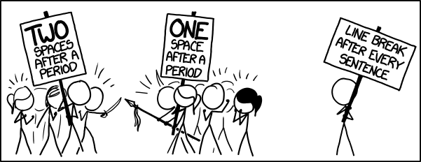
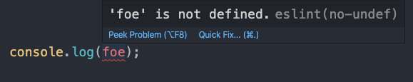

Programmers are creatures of habit. Once they get used to a coding pattern, a programming language, or _[that library](https://lodash.com/docs/4.17.15#get)_ which safely gets a property from an object, they will unconsciously apply them to their daily projects. It is quite understandable, since their line of work is redundant with micro-decisions to make, and if they have to consult Stack Overflow for every time a semicolon is used, good luck with shipping that new product.

When these creatures meet, they also share their habits. Sure, there will be lengthy debates on _tabs versus spaces_, but to keep up with the growing Kanban board, peace will be made and agreement reached. A _convention_ is then created. Either a team member continues exercising their long-lived practice, or they abandon their own to fit in with the pack. Ingrained with that idea, the team chug along nicely.

One day, another fresh-faced programmer joins in. Filled with high hopes and ambitions, they ignite old flames on whether to put brackets inline or on a newline. The team put deadlines on hold to conjure up meetings. Eventually, they settle on another convention. But this time, to avoid other non-essential setbacks, the team write it down, in the form of plain-text. _Documentation_, they call it. It must serve better at encouraging everyone to comply with the agreements, right? At least, it is stored somewhere concrete, not in the lossy format of human memory. And it looks serious, too.

While everything is going well, the team realize using `'` instead of `"` is better for the eyes (because.) The transition should be easy. Some _Find & replace_ commands and it will be done. But a 10-page documentation has been written on the history of double quotation marks and how they can increase the number of keystrokes per minute. Someone should be responsible for rewriting the whole thing. But look at those deadlines. Into the backlog it goes, then.

For every revelation the team have, the backlog grows larger, and so does the documentation database. They can no longer tell apart the up-to-date from the deprecated. With every ancient tomb left untreated and read by other eager, new programmers, the team risk having bad ol' meetings cluttering their tight schedules and haunting their dreams. Something must be done to keep the documentation and the conventions _in sync_.

Programmers write code daily. So why not put the documentation _in_ the code? _It's All Writing_.

> Pragmatic Programmers embrace documentation as an integral part of the overall development process. Writing documentation can be made easier by not duplicating effort or wasting time, and by keeping documentation close at hand—in the code itself, if possible.
>
> — The Pragmatic Programmer

Someone might interpret this as writing comments. And it does mean that, to some extent. As a case in point, I write a lot of comments. They warn readers of the edge cases of a business logic; they provide the background to a technical decision. But in the context of documenting conventions, commenting does not make sense. Should one comment every time they put a semicolon after an expression? How do they update all those comments given a change of heart? Rather, with regard to upkeeping conventions, the quote above can be read as _turning the conventions into code_. Or automation, if you prefer. But what should be automated? And how?

The majority of the examples mentioned, including placing brackets, tabs and spaces, quotes, commas and semicolons, can be categorized as _formatting conventions_. Period. Searching for _code formatter_ results in [this](https://prettier.io/). Although Prettier is a household name to JavaScript developers, the idea is quite universal. It reads the code and spits out new code that follows predefined rules. As a matter of fact, the [algorithm](http://homepages.inf.ed.ac.uk/wadler/papers/prettier/prettier.pdf) behind Prettier is not limited to JavaScript. The gist is that no team should argue over code formatting, since there is a plethora of tools to handle that manual job. Define rules, or _document conventions_ as rules, and let them take care of the rest.

> When working in a team, reducing friction is important. This is especially true on large teams. While it's impossible to avoid friction entirely, the more we can leverage tools to make it easier to work together the better.
>
> — [A Prettier JavaScript Formatter](https://jlongster.com/A-Prettier-Formatter)

Formatting is easy. At least a missing semicolon in JavaScript should not make your application break down in the middle of peak season ([can it tho?](https://www.reddit.com/r/javascript/comments/4ee8cr/semicolons_matter/)) On the other hand, accidentally accessing an undeclared variable, or forgetting to `break` surely gives you a not-so-friendly talk with your manager. While compiled languages like C++ or Java can catch the majority of these bugs in compilation, the interpreted camp of JavaScript, Python, and friends may leave them ravaging in the wild. The conventions that prevent these bugs can be categorized as _code-quality conventions_, and the tools enforcing them are called _linters_. You have seen them at work before, in the form of _red squiggly lines_.

It just so happens that formatting conventions can also be employed using linters. Linters, however, go further than code formatter as they use heuristics and metadata to determine whether a piece of code is buggy before it is processed by the compilation step, or seen by unfortunate customers. Because they _scan_ the code without actually _running_ it, they are also called _static analyzers_. Aside from bugs catching, linters can be used for performance or security issues, or simply a stylistic choice of `switch` over `if`. It is up to your team to _document_ these rules into the linter engine. Tools such as [ESLint](https://eslint.org/) also allow declaring _[fixers](https://eslint.org/docs/developer-guide/working-with-rules)_, which automatically transform the undesirable code into one which complies with conventions. Set these up in your CI/CD pipelines, and suddenly you will have more time in code reviews for truly important things like architectural design and business decisions.

Formatting and code-quality conventions both deal with code, or how a programmer writes their code, to be precise. In practice, they also moving files and making directories, updating dependencies, pushing code to remote and running deploy jobs. These manual tasks are so ingrained in a daily workday of a programmer that we cannot discuss writing code without mentioning them. Depending on each team, there will be a set of steps, or conventions, required to correctly finish a task. Maybe do not store secret keys in git repositories. Or generate a changelog before making a pull request. These can be categorized as _workflow conventions_. As such, they are out of the scope of linters and code formatters.

> Any application that can be written in JavaScript, will eventually be written in JavaScript.
>
> — Jeff Atwood

Replacing _JavaScript_ with _code_, and we have an approach to implementing these conventions. Code is the essential ingredient of any automation, even the tools aforementioned. Using the programming language they write every day, a team can encode any task into a set of instructions (or scripts) that is self-documented, persistent, and repeatable. The scripts are sharable and executable by any member, so the team do not have to depend on any sole person with the knowledge of the steps (which is unreliable due to lossy memory). When the time comes for updating a workflow (which is highly probable), the team can simply modify the scripts and say goodbye to out-of-date documentation hell.

There are certainly more methods out there to manage internal conventions (bonus: [Danger](https://danger.systems/) - a set of tools that help reduce friction in code reviews). They, and the ones included in this post, serve an important mission: to encourage teams to focus on productive tasks like actually shipping features instead of bickering each other over things that can be automated. They also negate the need for manually maintaining a documentation database that is prone to deprecation. How does that sound? It sounds like _joy_ to me.

> [...] the internet is a veritable Candyland for the monkey mind, filled with delightful distractions that are unrelated to your current work. Slack wants to enable employees to do the best work of their lives, and providing a focused environment through tooling reinforces that value.
>
> — [The Joy of Internal Tools](https://slack.engineering/the-joy-of-internal-tools/)
