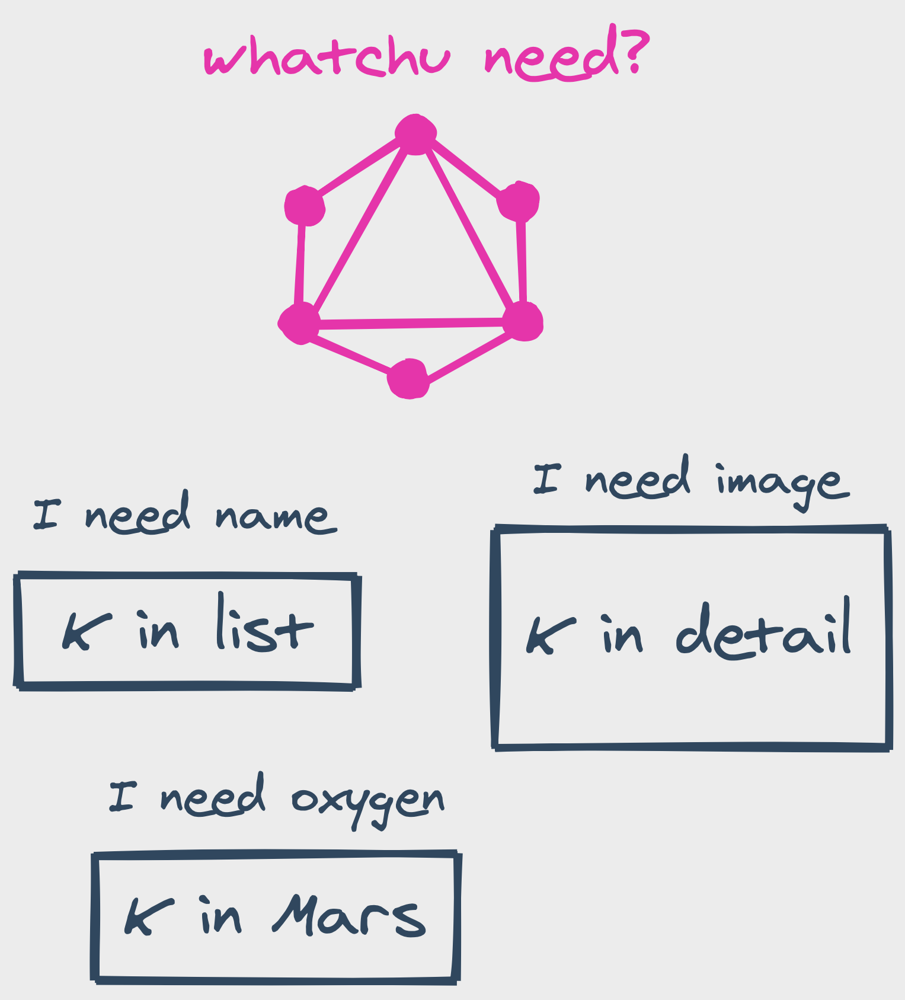

Pretty much every modern data-driven application operates on lists of things. Think of your typical social feeds, your online orders, or simply the results from your go-to search engine™️. Human love lists. To-do lists keep procrastination at bay. "Top 10 series to binge" lists drive boredom away.

> People are attracted to lists because we live in an era of overstimulation, especially in terms of information... And lists help us in organizing what is otherwise overwhelming.
>
> -- David Wallechinsky - "Book of Lists"

When we do not love lists, we love looking for details. Who is commenting on Jane's post? Is XXL still in stock? Modern applications work based on this principle. They stimulate mindless swiping with long infinity lists. They stimulate tapping for _more details_ with visual hints and large hitboxes.

As a front-end developer, I encounter this scenario a lot at work. The application invokes a request to fetch a list of popular boba tea brands. A user selects their most favorite. The app invokes another request to fetch the details of said brand (call it K).

Recently, I have been asking myself. Are both K boba tea brands the same? Does the K returned from the list request point to the same thing as the K returned from the detail request?

When I first started writing front-ends, I had some dogmatic opinions on this issue. It is clear that both Ks refer to the same boba tea brand. How is it not if there is only one entry for K in the database? How is it not if when a user orders something, the transaction goes through that one and only K boba tea brand? To consider that the versions of K are different is to accept the fact that K is duplicated every time someone adds a unique view of K. How many screens does an average boba tea application contain?

Equipped with said opinions, I would declare only one slot for K in the memory. Call it the domain entity. This domain entity represents every instance K is viewed. Whether K is returned from the list request or the detail request, put it into the domain entity.

I felt pretty confident about this approach. It stays true to the Single Source of Truth™️ principle. It enables trivial modifications to the domain entity without worrying about keeping each view in sync. Ain't nobody got time for that.

All is well, and suddenly a new requirement pops up. They plan to add extra labels (100% sale off or the like) which overlay the thumbnail image of K brand **on its detail view**. To keep it simple for the client, it is decided that the thumbnail will be modified before it is returned with K in the detail request. "Let the server guys take care of it." - reassuringly, the client devs talk to themselves.

Somehow, each time a user visits the detail view of K, the thumbnail image in the list item is **changed** to the one in the detail view. The client devs ask the server guys. "Oh, we reuse the `image` field for the modified thumbnail." The client devs proceed to find clues in the code. **K returned from the list request also uses the `image` field for its thumbnail**.

Disregarding some major plot holes, combining K from list and detail requests has created an interdependency between list and detail views of K. Fetching detail data for K has modified the `image` property of the **domain entity** of K, which in turn modified the list item view that is depending on this domain entity.

Tis but a small bug! An adapter to transform `image` in the detail request to `labeled_image` in K domain entity should do the trick. For now, K in the list item will use the `image` property, while K in detail will refer to `labeled_image`. Decoupling has never been so easy.

As time goes by, the team grows, and so does the number of requirements and functions. "Let's add a banner!" "How about a highlight over the brand name?" Views are built to satisfy users' needs. Adapters are created to keep the domain entity from getting improperly overridden. One day, a new developer adjusts the `description` property of K domain entity and suddenly the screen gets covered with promotion ads for G - the competing boba tea brand.

You get the idea. The domain entity is monkey patched over and over again, up to the point where no one has the slightest idea what it really is. The situation can get extra complicated when nested data and circular dependencies are introduced.

To a certain extent, creating a domain entity eases the maintenance cost of any source of data in the application. Go over that limit and you are greeted with one heck of a spaghetti dish.

What if I throw the domain entity away? By giving to the fact that users can look at a piece of data from an insurmountable number of perspectives, I can convince myself to see each slice of K boba tea brand as unique. It does not matter if K returned from the list request has the same name as K returned from the detail request. Each one is scoped to only its local view.

It looks like the problem with interdependency between views has been resolved. If the detail request handler wants to modify the `image` field to accommodate for an animating elephant, the client devs do not have to worry about the list not having enough _room_. Developer experience is greatly improved, especially for large teams with multiple views of K boba tea brand.

But developer experience often comes at the cost of user experience. Someone has just pushed another new requirement and it defines a **like** action that users can use to mark their favorite brands. This action is implemented by rendering a 💙 button in both the detail view and the list item view of a boba tea brand. When a user presses this button, it turns ❤️ to reflect the fact that the brand has been **liked**.

Picture a flow where a user has just navigated to the detail view of K after tapping on the list item. It is logical to assume that the list and detail requests have both been invoked (otherwise there would not be any data). Therefore, the only request left to be called is the one to update the like state of K when the user presses 💙. What will happen if the user presses 💙?

Suppose the like request is successful and K on the cloud is updated. Because the detail view of K is in focus, it is trivial to change 💙 to ❤️ by locally updating the view state or calling the detail request again to get the latest data. What about K item view? I have neither adjusted its local state nor called the list request to refresh data, so there is a high probability of it still displaying 💙.

If I still had the domain entity lying around, it would be just a matter of modifying the `liked` property, and _voilà_ every view subscribing to it would be automatically updated. Given that it has been thrown away, the alternative solution I often see is to set a flag to signal the list view to run the refresh procedure when it regains focus. Or if the list data can be refreshed by some kind of messages, then a message is dispatched after the user presses 💙 in the detail view. Anyhow, the detail view must know which view has the like logic. An interdependency between views is again created, this time somewhat less elegant because a view must have explicit awareness of others. And I have not touched on how a **list** request is needed to only update an individual item.

I have examined both ends of the spectrum. As with everything in life, balance is the key to achieve a maintainable design, which means both approaches can coexist. When to use which largely depends on the **ubiquity** and **interactivity** of the type of data in focus with regard to the application. Does it get a lot of _views_? Is it mutated frequently? When the data type appears everywhere but is rarely changed throughout a user session (like [HackerNews articles](https://news.ycombinator.com/)), then there is no point keeping a domain entity. If the data type is interactive and pops up in a handful of screens, it would be wise to save the dynamic state somewhere and make it observable so that any update is synchronized between multiple instances. What about that one which is both ubiquitous and ever-changing? A partial domain entity to store only the interactive slice of the data (such as the liked status) so that it does not get overwhelmed while changes are still guaranteed to be propagated.

I am bad at graph, and the one above surely does not cover every case one has to encounter when handling data in real applications. In an ideal world, a developer does not have to be asking these questions at all. In that world, one just has to define what pieces of data a view needs without worrying about synchronization and invoking network requests. Getting out of the _framework-agnostic_ vibe of this post, I think [GraphQL](https://graphql.org/) comes pretty close to implementing this idea. Data definition is declarative as it should be. The cogs and gears executing the procedures to get the data are nicely abstracted out, leaving developers with only the essentials to get their priorities straight and focus on the right things.

Sure, it is a long way to go from taking care of everything to saying [fuck it all](https://www.youtube.com/watch?v=yJ-jvEd0pDw). But for the sanity of my colleagues and me in the chaos of rapidly changing, revamping, remolding, metamorphosing (yes I got that word from a thesaurus) applications, I'd say _why not?™️_

_You may or may not see it coming, but the title is inspired by this meme. I think it captures the vibe of this post rather nicely._

